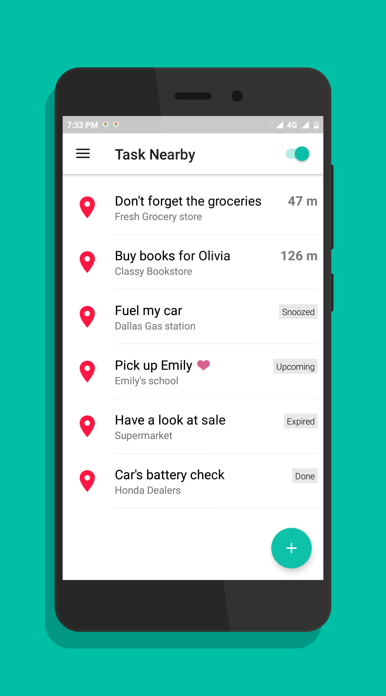
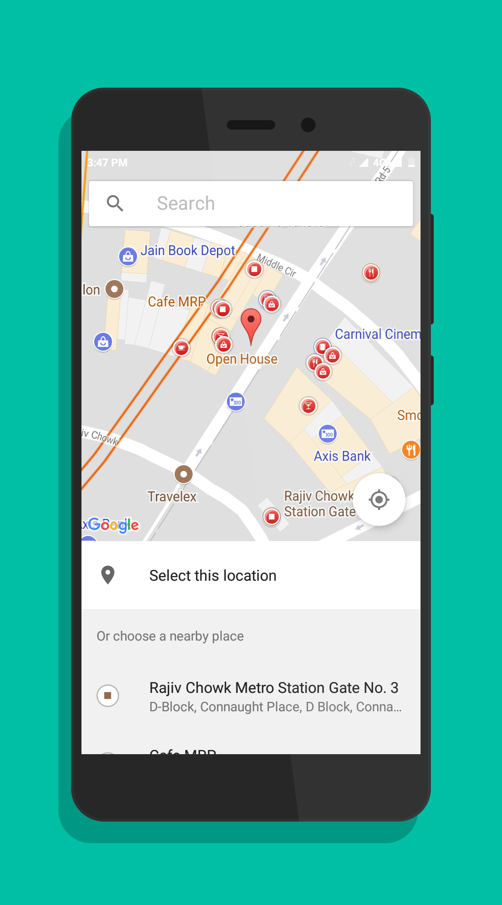
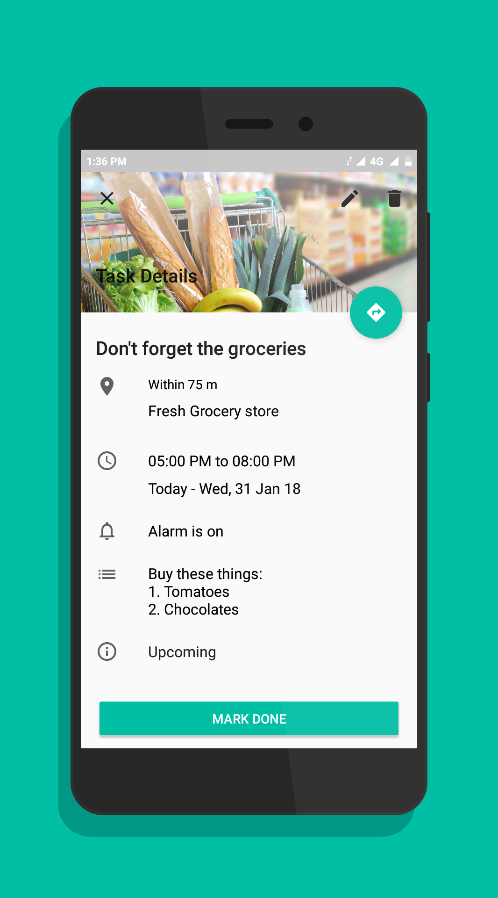
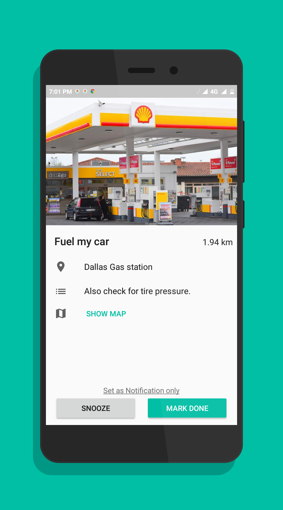
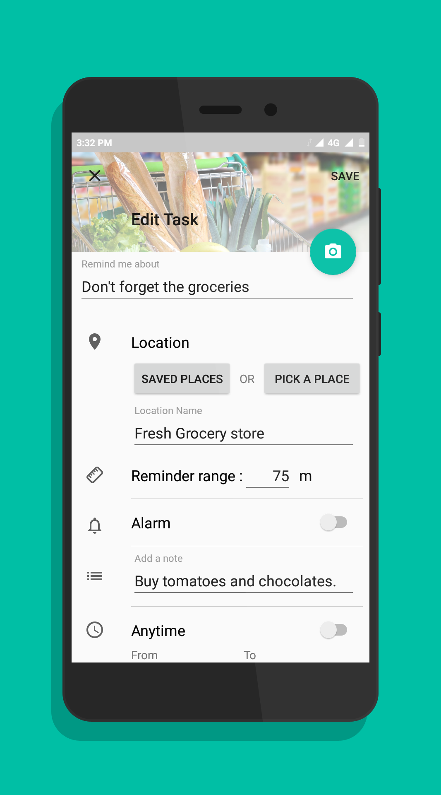
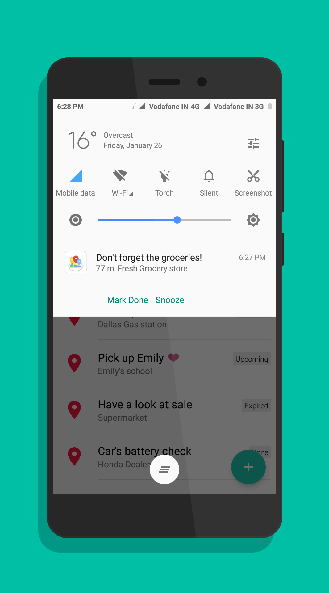

<h2>TaskNearby</h2>
<h5>Tailor made location reminders, just for you.</h5>
<!--  -->

  

&nbsp;
&nbsp;
&nbsp;
&nbsp;
&nbsp;
&nbsp;

Task Nearby provides elegantly designed, easy to use location reminders which are highly personalized for you.

<h5>Battery efficient</h5>
The app utilizes the device battery in the most efficient and productive way possible. It intelligently monitors device motion and turns off gps when not required.

<h5>Power saving mode</h5>
Enabling this, lowers battery consumption by retrieving user's location from mobile towers or WiFi networks.

<h5>Reminders- Alarms and notifications</h5>
This app provides customizable alarms and notifications. It also provides voice reminders which are helpful while driving.

